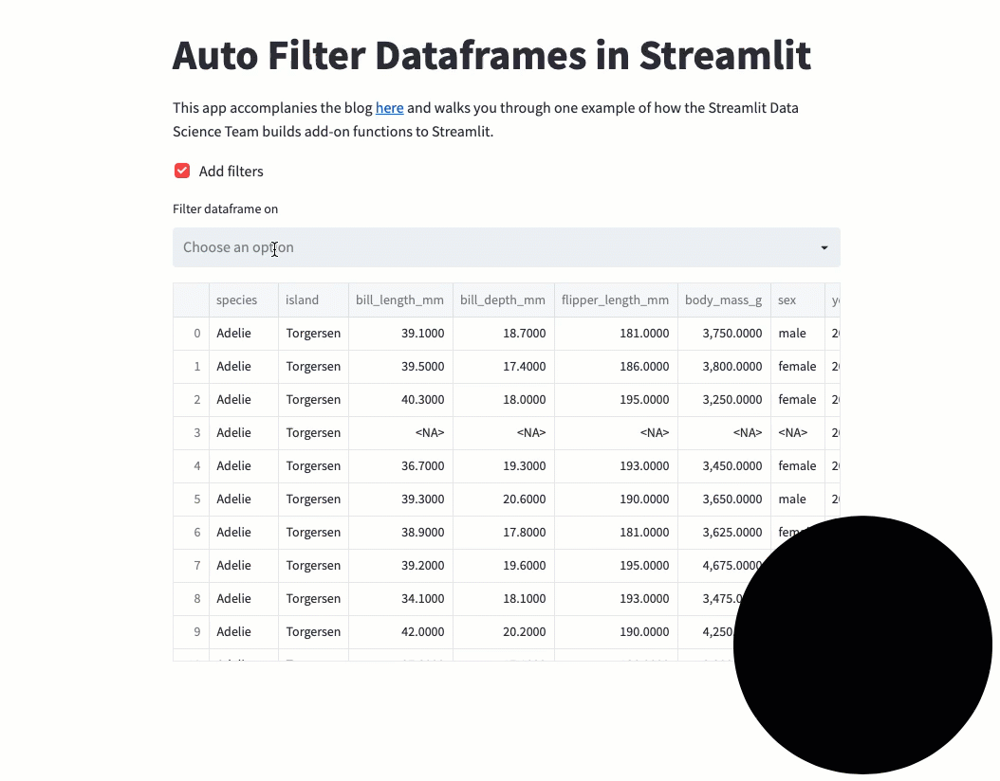

# Streamlit Auto Filter Dataframes

### Summary

This repo exists as a supplement to the Streamlit Data Team's [blog post]() 🎉 about how we added a small function to add a filtering UI to the dataframes we put in Streamlit apps. We wanted to include a proper repo to make it easier to copy and play around with!

