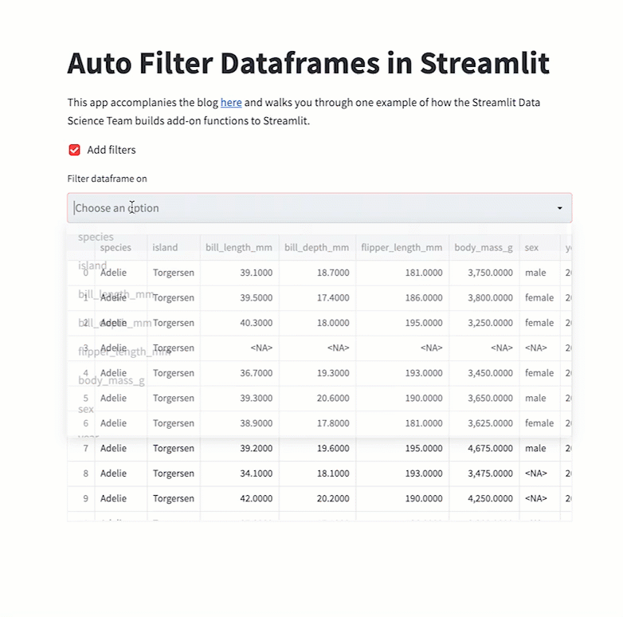

 <a href="https://github.com/arnaudmiribel/streamlit-extras"> </img></a>

# Streamlit Auto Filter Dataframes

### Summary

This repo exists as a supplement to the Streamlit Data Team's [blog post](https://blog.streamlit.io/auto-generate-a-dataframe-filtering-ui-in-streamlit-with-filter_dataframe/) 🎉 about how we added a small function to add a filtering UI to the dataframes we put in Streamlit apps. We wanted to include a proper repo to make it easier to copy and play around with!

